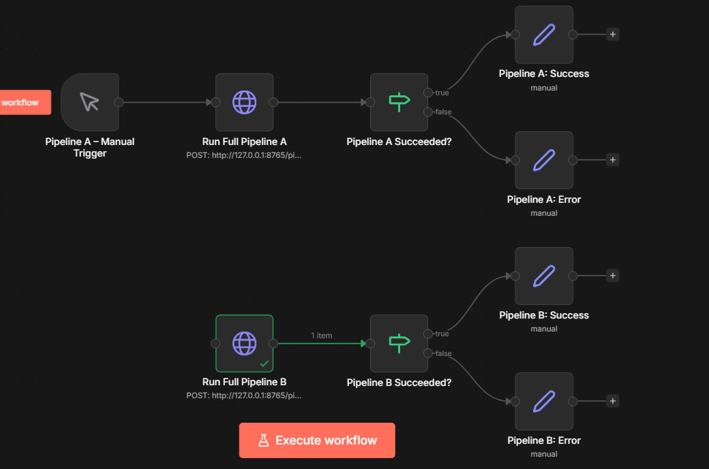

# Clara Agent Pipeline

A zero-cost, locally reproducible automation pipeline that converts customer call transcripts into structured Retell AI voice agent configurations. Built for the Clara Answers intern assignment.

## 🎥 Watch the Demo

[](https://www.youtube.com/watch?v=UIsep4a4iHo)

*Click the image above to watch the 4-minute full video walkthrough, demonstrating the CLI pipeline, n8n orchestration, and the Streamlit UI dashboard.*

## 🏗 Architecture & Data Flow

The system processes raw transcripts through a two-phase pipeline using a robust rule-based extraction engine with an optional local LLM fallback. This ensures deterministic outputs while completely avoiding mandatory paid API dependencies.

```text
[ Raw Transcript (.txt) ]
       │
       ▼
[ Normalization Layer ] ── Removes fillers, normalizes times/days
       │
       ▼
[ Extraction Engine ] ───── Regex/Heuristic rules (fallback: Local Ollama)
       │
       ▼
[ Account Memo JSON ] ───── Structured intermediate representation
       │
       ▼
[ Patch/Merge Engine ] ──── (Pipeline B only) Field-level diffing & deep merge
       │
       ▼
[ Prompt Generator ] ────── Assembles Retell Agent Spec (v1 or v2)
```

### Pipelines

*   **Pipeline A (Demo Call):** Ingests an initial discovery call transcript, extracts core business logic (hours, services, routing rules, emergency definitions), and generates a `v1` `.json` configuration and Retell agent spec.
*   **Pipeline B (Onboarding Update):** Ingests an onboarding call transcript, extracts requested changes, applies a deep-merge patch against the `v1` configuration, and produces a `v2` configuration alongside a detailed field-level `changes.md` changelog.

---

## 🚀 How to Run Locally

### Prerequisites
*   Python 3.9+
*   Node.js (for n8n, optional but recommended)
*   *Optional:* [Ollama](https://ollama.ai/) running locally with `llama3` for LLM fallback.

### Environment Setup

```bash
git clone <repository-url>
cd clara-agent-pipeline
python -m venv venv

# Windows
venv\Scripts\Activate.ps1
# Mac/Linux
source venv/bin/activate

pip install -r requirements.txt
```

### Option 1: Pure CLI Execution (No n8n Required)

**Run Pipeline A (Single Transcript):**
```bash
python scripts/normalize_transcript.py --input dataset/demo_calls/demo_transcript_001.txt --output dataset/demo_calls/demo_transcript_001_normalized.txt
python scripts/extract_memo.py --input dataset/demo_calls/demo_transcript_001_normalized.txt --account_id account_001 --output_dir outputs/accounts/account_001/v1
python scripts/generate_agent.py --memo outputs/accounts/account_001/v1/memo.json --output_dir outputs/accounts/account_001/v1
```

**Run Pipeline B (Patch Update):**
```bash
python scripts/normalize_transcript.py --input dataset/onboarding_calls/onboarding_001.txt --output dataset/onboarding_calls/onboarding_001_normalized.txt
python scripts/apply_patch.py --v1_memo outputs/accounts/account_001/v1/memo.json --onboarding dataset/onboarding_calls/onboarding_001_normalized.txt --output_dir outputs/accounts/account_001/v2 --force
python scripts/generate_agent.py --memo outputs/accounts/account_001/v2/memo.json --output_dir outputs/accounts/account_001/v2 --version 2.0 --force
python scripts/changelog.py --v1 outputs/accounts/account_001/v1/memo.json --v2 outputs/accounts/account_001/v2/memo.json --output outputs/accounts/account_001/v2/changes.md --force
```

**Batch Processing:**
Runs Pipeline A over all transcripts in a directory, outputting a summary report to `outputs/`.
```bash
python scripts/batch_process.py --dataset_dir dataset/demo_calls --output_dir outputs/accounts
```

### Option 2: Streamlit Dashboard

A visual UI for monitoring pipeline runs, inspecting generated JSONs, and viewing color-coded diffs.
```bash
streamlit run dashboard.py
```
*Open `http://localhost:8501` in your browser.*

---

## ⚙️ n8n Workflow Instructions

The repository includes a pre-configured n8n workflow (`workflows/n8n_workflow.json`) that uses HTTP Request nodes to orchestrate the pipeline asynchronously.



1.  **Start the Local API Server:**
    The n8n workflow communicates with the python scripts via a lightweight local server to bypass sandbox limitations.
    ```bash
    python scripts/pipeline_server.py --port 8765
    ```
2.  **Start n8n:**
    ```bash
    npm install -g n8n
    n8n start
    ```
3.  **Import & Execute:**
    *   Open `http://localhost:5678`.
    *   Click **Add Workflow** -> **Import from File** and select `workflows/n8n_workflow.json`.
    *   Click **Execute Workflow** on either the Pipeline A or Pipeline B manual trigger node.

---

## 📂 Dataset Injection

To process your own calls:
1.  Drop raw `.txt` transcript files into `dataset/demo_calls/` (for Pipeline A) or `dataset/onboarding_calls/` (for Pipeline B).
2.  Run the batch processor or trigger the pipeline via CLI/n8n pointing to your new file paths. The system will automatically generate safe `account_id` slugs based on extracted company names.

### Cleaning Outputs (Reset for New Data)
If you want to clear all previously generated memos, agent specs, and changelogs to start fresh with a new dataset, you can run the following PowerShell commands:
```powershell
# Clears all generated account folders and the batch summary report
Remove-Item -Recurse -Force outputs\accounts
Remove-Item -Force outputs\summary_report.json
New-Item -ItemType Directory -Force -Path "outputs\accounts"
```

---

## 💾 Output Storage

All generated artifacts are deterministically written to the `outputs/` directory.

```text
outputs/
├── summary_report.json            # Batch metrics
└── accounts/
    └── <account_id>/
        ├── v1/
        │   ├── memo.json          # Intermediate structured data
        │   └── agent_spec.json    # Retell-ready system prompt config
        └── v2/
            ├── memo.json
            ├── agent_spec.json
            └── changes.md         # Field-level diff (Markdown)
```

---


