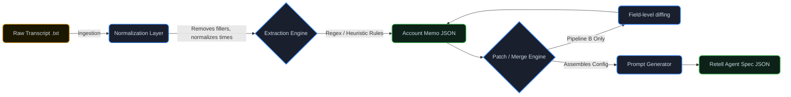

<div align="center">

# 🤖 Clara Agent Pipeline

**A zero-cost, locally reproducible automation pipeline that converts customer call transcripts into structured Retell AI voice agent configurations.**

[](https://www.python.org/)
[]()
[](https://dsk2307-zentrade-assignment-dashboard-0aq89d.streamlit.app/)
[]()


[Live Dashboard Demo](https://dsk2307-zentrade-assignment-dashboard-0aq89d.streamlit.app/) • [Watch Demo Video](https://www.youtube.com/watch?v=UIsep4a4iHo)

</div>

---

## � Project Overview

The **Clara Agent Pipeline** is designed to seamlessly bridge the gap between human conversations and automated AI agent configurations. Built for the Clara Answers intern assignment, this project provides a deterministic, rule-based approach to extracting structured data from raw call transcripts without relying on costly third-party APIs.

- 🎙️ **Ingests transcripts** from initial discovery and onboarding calls.
- 🧠 **Extracts core business logic** (e.g., hours, services, routing, emergency definitions).
- ⚙️ **Generates Retell AI configs** ready for real-world deployment.
- 🔄 **Handles patch updates** with field-level granular diffs.
- 📊 **Provides a visual dashboard** for monitoring pipeline health.

---

## ✨ Key Features

| Feature | Description |
|---------|-------------|
| 💸 **Zero-Cost Pipeline** | Robust rule-based extraction engine completely avoids mandatory paid API dependencies. |
| 💻 **Local Reproducibility** | Run everything natively on your machine using Python and optionally n8n. |
| 📜 **Transcript Processing** | Effectively removes fillers, normalizes times, and extracts exact business policies. |
| 🤖 **Retell AI Integration** | Automatically constructs valid Retell agent specifications seamlessly. |
| 🎛️ **Streamlit Dashboard** | A beautiful local UI to monitor runs, inspect JSONs, and view color-coded diffs. |
| 🐙 **n8n Automation** | Pre-configured orchestration for asynchronous, node-based pipeline processing. |

---

## ⚡ Quick Start

Want to see it in action without reading the docs? Just try the live cloud dashboard!

👉 [**Try the Interactive Streamlit UI**](https://dsk2307-zentrade-assignment-dashboard-0aq89d.streamlit.app/)

Or check out the [**4-minute video walkthrough**](https://www.youtube.com/watch?v=UIsep4a4iHo) demonstrating the CLI pipeline, n8n orchestration, and the Streamlit UI dashboard.

---

## 🏗 Architecture & Data Flow

The system processes raw transcripts through a two-phase pipeline using a robust rule-based extraction engine, ensuring deterministic outputs.

<details open>
<summary><b>Click to toggle the Architecture Diagram</b></summary>


</details>

### Pipeline Stages Explained

* 🅰️ **Pipeline A (Demo Call)**: 
  * **Input:** Single discovery call transcript.
  * **Process:** Normalizes text, extracts core business rules.
  * **Output:** Generates `v1` `.json` configurations and a complete Retell agent spec.
* 🅱️ **Pipeline B (Onboarding Update)**: 
  * **Input:** Subsequent onboarding call transcript.
  * **Process:** Extracts change requests, applies a deep-merge patch against the `v1` configuration.
  * **Output:** Produces an updated `v2` configuration alongside a detailed field-level `changes.md` changelog.

---

## � Project Structure

```text
📦 clara-agent-pipeline
 ┣ 📂 dataset/               # Input call transcripts
 ┃ ┣ 📂 demo_calls/          # V1 initialization transcripts
 ┃ ┗ 📂 onboarding_calls/    # V2 update transcripts
 ┣ 📂 outputs/               # Auto-generated deterministic artifacts
 ┣ 📂 scripts/               # Core pipeline Python execution scripts
 ┣ 📂 workflows/             # n8n automation definitions
 ┣ 📜 dashboard.py           # Streamlit UI frontend
 ┣ 📜 requirements.txt       # Python dependencies
 ┗ 📜 README.md              # Project documentation
```

### Generated Artifact Structure

All generated artifacts are deterministically written to the `outputs/` directory in a clean hierarchy.

```text
outputs/
├── summary_report.json            # Batch processing metrics
└── accounts/
    └── <account_id>/              # Auto-generated slug based on company name
        ├── v1/
        │   ├── memo.json          # Intermediate structured data
        │   └── agent_spec.json    # Retell-ready system prompt config
        └── v2/
            ├── memo.json
            ├── agent_spec.json
            └── changes.md         # Field-level diff (Markdown)
```

---

## 🚀 How to Run Locally

### 1️⃣ Prerequisites
- **Python 3.9+**
- **Node.js** (optional, required only for n8n integration)
- **Plotly** (auto-installed via `requirements.txt` — powers the interactive charts)

### 2️⃣ Environment Setup
Clone the repository and set up a standard Python virtual environment.

```bash
# Clone and enter the repo
git clone <repository-url>
cd clara-agent-pipeline

# Create virtual environment
python -m venv venv

# Activate (Windows)
venv\Scripts\Activate.ps1
# Activate (Mac/Linux)
source venv/bin/activate

# Install dependencies
pip install -r requirements.txt
```

### 3️⃣ Running the Pipeline

You can run the pipeline through three different methods depending on your preferences.

<details open>
<summary><b>Option A: Pure CLI Execution (No n8n Required)</b></summary>

**Run Pipeline A (Single Transcript)**
```bash
python scripts/normalize_transcript.py --input dataset/demo_calls/demo_transcript_001.txt --output dataset/demo_calls/demo_transcript_001_normalized.txt
python scripts/extract_memo.py --input dataset/demo_calls/demo_transcript_001_normalized.txt --account_id account_001 --output_dir outputs/accounts/account_001/v1
python scripts/generate_agent.py --memo outputs/accounts/account_001/v1/memo.json --output_dir outputs/accounts/account_001/v1
```

**Run Pipeline B (Patch Update)**
```bash
python scripts/normalize_transcript.py --input dataset/onboarding_calls/onboarding_001.txt --output dataset/onboarding_calls/onboarding_001_normalized.txt
python scripts/apply_patch.py --v1_memo outputs/accounts/account_001/v1/memo.json --onboarding dataset/onboarding_calls/onboarding_001_normalized.txt --output_dir outputs/accounts/account_001/v2 --force
python scripts/generate_agent.py --memo outputs/accounts/account_001/v2/memo.json --output_dir outputs/accounts/account_001/v2 --version 2.0 --force
python scripts/changelog.py --v1 outputs/accounts/account_001/v1/memo.json --v2 outputs/accounts/account_001/v2/memo.json --output outputs/accounts/account_001/v2/changes.md --force
```

**Batch Processing**
Runs Pipeline A over all transcripts in a directory, outputting a summary report.
```bash
python scripts/batch_process.py --dataset_dir dataset/demo_calls --output_dir outputs/accounts
```

</details>

<details open>
<summary><b>Option B: Streamlit Dashboard (Enhanced UI)</b></summary>

A professional SaaS-style visual UI featuring:
- 📊 **Interactive Plotly charts** — pipeline completion bar chart & v1 vs v2 donut chart
- 💳 **KPI metric cards** with gradient accents and hover effects
- 🔍 **Diff Viewer** with compact/detailed toggle and colour-coded field highlights
- 📜 **Live Logs tab** — searchable, filterable table view of `logs/pipeline.log`
- ⚡ **Step indicator** in Pipeline B showing Normalize → Patch → Generate → Changelog progress
- 🔎 **Account search & filter** (v1 Only / v2 Onboarded)

```bash
pip install -r requirements.txt   # installs streamlit + plotly
streamlit run dashboard.py
```
> *Open `http://localhost:8501` in your browser.*

</details>

<details>
<summary><b>Option C: n8n Workflow Orchestration</b></summary>

The repository includes a pre-configured workflow (`workflows/n8n_workflow.json`) that uses HTTP Request nodes to orchestrate the pipeline asynchronously.


1. **Start the Local API Server:** The workflow communicates with scripts via a lightweight local server to bypass sandbox limitations.
   ```bash
   python scripts/pipeline_server.py --port 8765
   ```
2. **Start n8n:**
   ```bash
   npm install -g n8n
   n8n start
   ```
3. **Import & Execute:**
   * Open `http://localhost:5678`.
   * Click **Add Workflow** -> **Import from File** and select `workflows/n8n_workflow.json`.
   * Click **Execute Workflow** on either the Pipeline A or Pipeline B manual trigger node.

</details>

---

## �️ Dataset Injection

To process your own calls:
1. Drop raw `.txt` transcript files into `dataset/demo_calls/` (Pipeline A) or `dataset/onboarding_calls/` (Pipeline B).
2. Run the batch processor or trigger the pipeline via CLI/n8n pointing to your new file paths. 
3. The system will automatically generate safe `account_id` slugs based on extracted company names.

### 🧹 Cleaning Outputs (Reset for New Data)
If you want to clear all previously generated memos, agent specs, and changelogs to start fresh:

**Windows PowerShell:**
```powershell
Remove-Item -Recurse -Force outputs\accounts
Remove-Item -Force outputs\summary_report.json
New-Item -ItemType Directory -Force -Path "outputs\accounts"
```

**Mac/Linux:**
```bash
rm -rf outputs/accounts/* outputs/summary_report.json
mkdir -p outputs/accounts
```

---

<div align="center">
  <p>Built with ❤️ for the <b>Clara Answers</b> intern assignment.</p>
</div>

